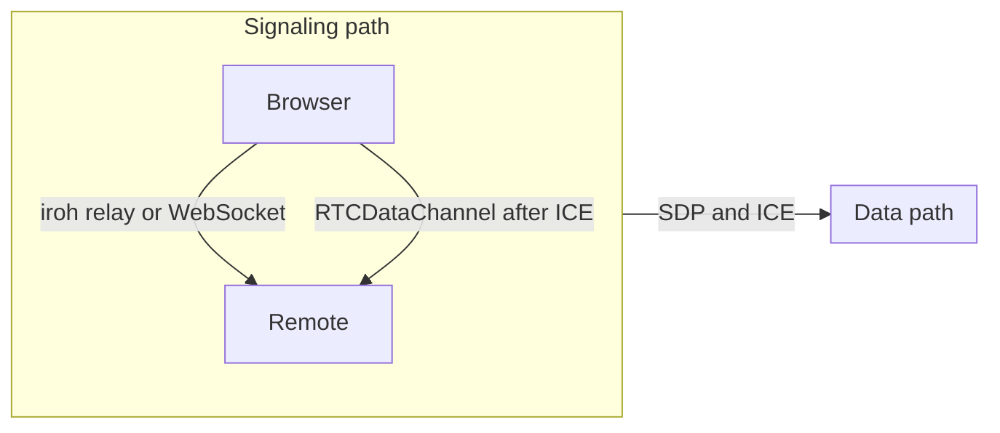
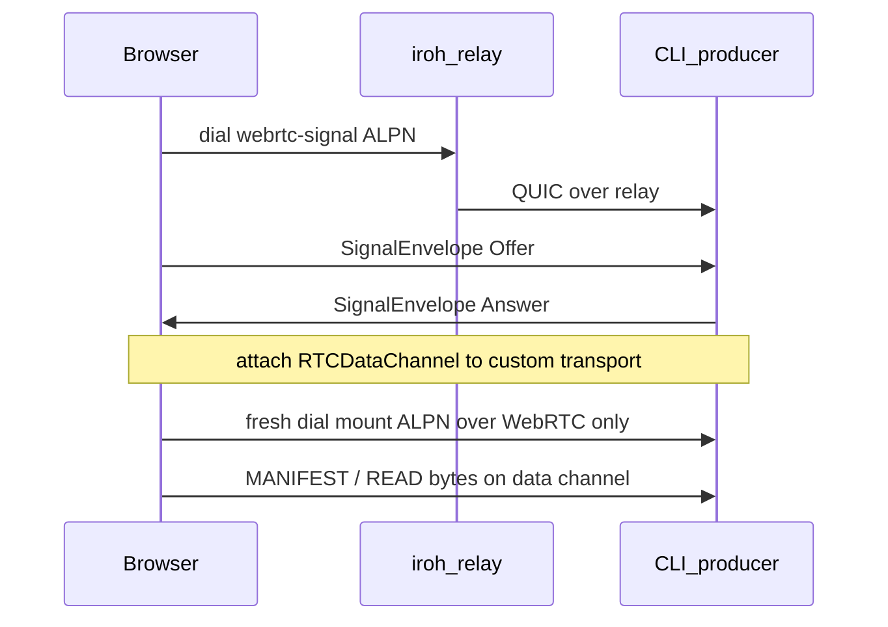

# Iroh + WebRTC research

Research into existing WebRTC + iroh implementations that can run on the web, how they are architected, and what we should borrow for [`crates/fofoca-iroh-webrtc-transport`](../../../crates/fofoca-iroh-webrtc-transport/). Covers the project landscape plus WebRTC data-channel transport practice. Dated August 2026.

Related product plan: [`docs/web-plan.md`](../../web-plan.md) (some NAT/TURN notes there are superseded; see [Open risks](#open-risks) and our architecture section below).

## TL;DR

The public landscape is thin: **two community crates** (plus one design-doc-stage repo) alongside **official iroh’s relay-only browser story** and a few adjacent experiments. Nobody ships a mature, n0-blessed WebRTC custom transport yet ([discussion #4024](https://github.com/n0-computer/iroh/discussions/4024)).

Our stack already matches n0’s preferred shape (str0m native, browser Web APIs, custom transport, iroh relay for signaling). The highest-ROI changes identified were **transport-layer**, not architectural, and the top batch has since landed:

1. **Done** — the data channel is now negotiated **unreliable + unordered** (`maxRetransmits: 0`) instead of the reliable+ordered default, so tunneled QUIC keeps the only congestion-control/retransmission loop. Loopback bench: median throughput 66 → 102 MiB/s, variance collapsed ([bench/RESULTS.md](bench/RESULTS.md)).
2. **Done** — the browser hub self-detaches sessions on channel close/error (reconnects used to hit “live session already exists” forever), TURN credentials are cached with a bounded fetch, and datagram drops are logged instead of silent.
3. Remaining gaps, in ROI order: host has STUN but no TURN; vanilla ICE (no trickle); JSEP orchestration duplicated five times. The browser-mount relay fallback from the first pass is **implemented** (`TransportMode` webrtc | relay | dynamic).

Do **not** replace our crate with SuddenlyHazel’s published package — cherry-pick dial intent / trickle / facade ideas only.

## Problem framing

Browsers cannot send UDP to arbitrary addresses, so iroh’s hole-punching does not port. Official browser support is **relay-only over WebSockets** ([wasm-browser docs](https://docs.iroh.computer/languages/wasm-browser)). Direct browser paths need WebRTC (or WebTransport with caveats — see [Transport practice](#transport-practice-findings)).

Custom transports (iroh ≥ 0.97, `unstable-custom-transports`) let an endpoint carry noq/QUIC datagrams over something other than UDP/relay. WebRTC is a natural fit **and** brings its own NAT traversal, so coordination payloads (SDP / ICE) still need another path. That coordination is **not** provided by the custom-transport API alone ([flub / matheus23 in #4024](https://github.com/n0-computer/iroh/discussions/4024)). Every working system below therefore splits:

## Landscape

| Project | Role | Runs on the web? |
| --- | --- | --- |
| **Ours** — [`crates/fofoca-iroh-webrtc-transport`](../../../crates/fofoca-iroh-webrtc-transport/) + [`agent-share-wasm-client`](../../../crates/agent-share-wasm-client/) | In-tree custom transport for agent-share | Yes: `web-sys` RTC + iroh signal ALPN; mount over a fresh WebRTC-only dial |
| **[SuddenlyHazel/iroh-webrtc-transport](https://github.com/SuddenlyHazel/iroh-webrtc-transport)** (`0.1.0-alpha.2` on [crates.io](https://crates.io/crates/iroh-webrtc-transport) / [docs.rs](https://docs.rs/iroh-webrtc-transport/)) | High-level facade over custom transport | Yes: `BrowserWebRtcNode` main-thread Wasm; native via **webrtc-rs** |
| **[anchalshivank/iroh-webrtc-transport](https://github.com/anchalshivank/iroh-webrtc-transport)** (from [#4024](https://github.com/n0-computer/iroh/discussions/4024)) | Library + browser/native demos | Yes: thin WASM iroh for JSEP; **JS** `RTCPeerConnection` in `static/app.js`; native **str0m** |
| **[imx-inc/iroh-webrtc](https://github.com/imx-inc/iroh-webrtc)** | Design-doc-stage generic transport ([PLAN.md](https://raw.githubusercontent.com/imx-inc/iroh-webrtc/main/PLAN.md)) | Planned only: str0m native + `web-sys` browser; trickle-ICE `SignalingMessage` enum; WebRTC-primary / relay-fallback path selection |
| **Official iroh** | Relay-only browser + custom-transport patterns | Relay yes; WebRTC not shipped. Patterns: [`iroh-tor-transport`](https://github.com/n0-computer/iroh-tor-transport), [`iroh-nym-transport`](https://github.com/n0-computer/iroh-nym-transport) |
| **Adjacent** | Not full iroh custom transports | [matchbox](https://github.com/johanhelsing/matchbox) (signaling swap idea in [iroh-examples#113](https://github.com/n0-computer/iroh-examples/issues/113)); abandoned in-tree effort [#3440](https://github.com/n0-computer/iroh/pull/3440); [iroh-live](https://github.com/n0-computer/iroh-live)’s WebTransport browser bridge (below) |

No other published “iroh custom transport + browser WebRTC” crates turned up. Every attempt converges on the same split we shipped — str0m-or-equivalent native, platform RTC in the browser, iroh as the signaling plane — which validates the architecture; the value of the survey is specific techniques, not code reuse.

**Name collision (resolved):** our workspace crate is `fofoca-iroh-webrtc-transport`. SuddenlyHazel’s package still occupies `iroh-webrtc-transport` on crates.io; treat them as unrelated implementations.

---

## Architecture write-ups

### Ours (`agent-share` / `fofoca-iroh-webrtc-transport`)

**Goal:** browser is a first-class mount consumer. File bytes never touch the iroh relay; relay is SDP rendezvous only.

**Split:** one crate, two feature-gated backends. Protocol that must not drift lives at the crate root:

| Piece | Location | Notes |
| --- | --- | --- |
| Transport id | `WEBRTC_TRANSPORT_ID = 0x5752_5443` (`"WRTC"`) | Tor-style mnemonic; `custom_addr(endpoint_id)` = id + 32-byte pubkey |
| Signal envelope | `SignalEnvelope` Offer/Answer/Error | Vanilla ICE (candidates in SDP); `SIGNAL_VERSION = 1`; max 64 KiB |
| Data channel label | `"iroh"` | One channel per peer; negotiated **unreliable + unordered** (`maxRetransmits: 0`) — QUIC above owns reliability |
| Framing | **none** | One QUIC datagram = one binary SCTP message |

**Host (`feature = "host"`):** str0m sans-io + tokio driver; RFC 5389 STUN Binding from the **media socket** (`host/stun.rs`) for `server_reflexive` candidates; no TURN. Structure follows `iroh-tor-transport` / multihop: factory → endpoint → registry sender → per-session driver. Outbound is a bounded queue with lossy `try_send` (drop-on-full, counted in `dropped_tx` — currently write-only).

**Web (`feature = "web"`):** browser `RTCPeerConnection` via `web-sys`; default STUN (Google + Cloudflare); `IceServers::with_turn_fallback()` may add short-lived credentials from `https://turn.elixir-webrtc.org/` (demo TURN, not production — cached per tab until near expiry, fetch bounded at 1.5 s). Gather wait ~10s then freeze SDP. Outbound gated by `bufferedAmount` (drop-on-full, drops logged rate-limited). Setup waits poll on 50 ms timers rather than listening to `icegatheringstatechange` / `onopen`.

**Signaling ownership:** application layer. ALPNs in `agent-share-proto`:

- `agent-share/webrtc-signal/1` — one bi-stream, one envelope each way
- `agent-share/mount/1` — file protocol on a **fresh** connection

**Why two connections:** iroh fans Initial packets to candidate paths only while the remote has no selected path. You cannot upgrade a live relay connection onto a newly attached WebRTC transport. Pattern: signal → `attach` session → dial mount against `EndpointAddr` with only `TransportAddr::Custom(custom_addr(remote))`.

**Wasm consumer quirk:** custom transports are registered at endpoint build time, but the session does not exist until signaling finishes. `ShareClient::connect` therefore uses **two endpoints, one key**: relay signaller, then Minimal + WebRTC-only data endpoint. Data-plane fallback when ICE fails is now handled by `TransportMode` (webrtc | relay | dynamic; see recommendation 1).

**Session lifecycle:** the browser hub self-detaches a session when its data channel closes or errors (deferred to a task so the closure is not dropped mid-call), the keepalive clears JS handlers and closes the peer connection on drop, and both producers' `stop` detach all live sessions (recommendation 3, implemented).

**CLI consumer:** registers WebRTC additively; prefers IP/relay hole-punching first; WebRTC after discovery retries fail (avoids double congestion control when native works).

### SuddenlyHazel / crates.io `iroh-webrtc-transport`

**Goal:** bury WebRTC ceremony. App code dials with an iroh-style API; the crate owns bootstrap, ICE exchange, attach, and optional relay fallback.

**API surface:**

- Browser: `BrowserWebRtcNode` + `browser_app!` (main-thread Wasm only; older worker architecture removed)
- Native: `NativeWebRtcIrohNode`
- Dial: `WebRtcDialOptions::{webrtc_preferred, webrtc_only, iroh_relay}` (default preferred)
- Lower level: `WebRtcTransport` + `configure_endpoint`, `NativeWebRtcSession`

**Native stack:** [webrtc-rs](https://crates.io/crates/webrtc) 0.17 (not str0m). **Browser stack:** `web-sys` RTC on the main thread, pumping iroh/noq through `RTCDataChannel`.

**Bootstrap signaling (built into the crate):** authenticated iroh stream carrying a richer `WebRtcSignal` enum:

- `DialRequest` (includes `BootstrapTransportIntent`)
- `Offer` / `Answer` (SDP)
- **`IceCandidate` / `EndOfCandidates`** (trickle ICE)
- `Terminal` (failure / fallback / cancel)

Data channel label: `"iroh-noq"`. Custom transport id mnemonic `iwrtc` (`0x6977_7274_6300_0001`) with capability vs session address kinds (session id derived from dial id).

**Framing:** private `IWRT` binary frame (magic + version + flags + session_id + segment_size + payload) over the data channel — extra layer above noq packets.

**ICE policy:** STUN-only in `WebRtcIceConfig` (TURN URLs rejected). When WebRTC cannot promote, **fallback is iroh relay**, not TURN. Tunables for queue sizes, frame max payload, DataChannel buffered-amount high/low watermarks (defaults in the multi‑MiB range).

**Demos:** Trunk browser chat / ping-pong examples under `examples/`.

**Takeaway vs us:** higher-level product API; trickle ICE; explicit dial intent with relay data fallback; heavier framing and webrtc-rs native; same high-level split (iroh bootstrap → WebRTC data).

### anchalshivank / discussion #4024 crate

**Goal:** working reference after n0 asked for an out-of-tree crate (patterned on tor/nym transports). Author reported native–native, browser–browser, and browser–native working (May 2026), with a note about moving fully to str0m (Cargo already depends on str0m).

**Library shape:**

| Piece | Role |
| --- | --- |
| `Signaling` trait | `send_envelope` / `recv_envelope` |
| `SignalEnvelope` | JSON offer/answer SDP |
| `QuicSignaling` | newline-framed JSON on iroh bidi (`JSEP_SIGNALING_ALPN = iroh-webrtc-transport/signal/0`) |
| `TcpWebSocket` | same envelopes over tokio-tungstenite |
| `negotiate_dc_as_{offerer,answerer}` | str0m JSEP over any `Signaling` |
| `WebRtcTunnel` / `WebRtcTransport` | bridge SCTP ↔ `CustomTransport` poll_send/poll_recv |

**Native ICE:** `jsep_core` binds ephemeral UDP and adds a **host** candidate. No STUN helper comparable to ours — LAN-friendly demos, weaker NAT story than our host STUN path.

**Browser architecture (important delta):** WASM (`browser-iroh`) only binds an iroh endpoint and exposes `acceptJsepSignaling` / `dialJsepSignaling`. **RTC lives in JavaScript** (`static/app.js`): `RTCPeerConnection`, gather-complete, data channel chat. Optional WebSocket room signaling server pairs two tabs without node ids. So the demo is “iroh for signaling + JS WebRTC for data,” not “full iroh custom transport inside the tab for app traffic” (though Rust `examples/server` / `client` show the full attach path natively).

**Transport id:** `u64::from_le_bytes(*b"irohwebr")` — third distinct id in the ecosystem.

**Takeaway vs us:** pluggable signaling and excellent demos; browser split (JS RTC) is simpler for chat UIs but not our all-Wasm mount client; native NAT gathering lags ours.

### imx-inc/iroh-webrtc (design doc only)

[PLAN.md](https://raw.githubusercontent.com/imx-inc/iroh-webrtc/main/PLAN.md) (April 2026, 0 stars, no README) sketches a generic WebRTC custom transport following iroh’s own transport patterns: str0m native, `web-sys` browser, dual compilation, a **trickle-ICE `SignalingMessage` enum** (`Offer | Answer | IceCandidate`) over in/out channels, and explicit **path selection** (WebRTC primary, relay fallback). No meaningful code.

**Takeaway vs us:** nothing to run; the trickle envelope and path-selection framing are a second independent vote for recommendations 5 and 11.

### Official iroh and adjacent

**Browser (official):** compile with wasm-bindgen; permanent WebSocket to home relay; E2E encrypted but no direct path ([wasm-browser](https://docs.iroh.computer/languages/wasm-browser), [tracking #2799](https://github.com/n0-computer/iroh/issues/2799)). Shipped in 0.32 “Browsers Alpha” / 0.33 ([blog](https://www.iroh.computer/blog/iroh-0-32-0-browser-alpha-qad-and-n0-future), [blog](https://www.iroh.computer/blog/iroh-0-33-0-browsers-and-discovery-and-0-RTT-oh-my)); the canonical examples are [iroh-examples](https://github.com/n0-computer/iroh-examples) `browser-echo` / `browser-chat` — no WebRTC anywhere. The 2024 roadmap (“[Iroh & the Web](https://www.iroh.computer/blog/iroh-and-the-web)”) listed WebRTC data channels as Phase 3; it was never built, and the [iroh 1.0 announcement](https://www.iroh.computer/blog/v1) (June 2026) mentions custom transports (BLE, LoRa, Tor) with zero WebRTC. FAQ still contrasts WebRTC complexity with iroh’s QUIC model and notes WebRTC remains the hole-punch option in browsers ([FAQ](https://docs.iroh.computer/about/faq)).

**Custom transport pattern:** implement `CustomTransport` / `CustomEndpoint` / `CustomSender`; often ship a `Preset` that also installs address lookup ([tor blog](https://www.iroh.computer/blog/tor-custom-transport), [0.97 blog](https://www.iroh.computer/blog/iroh-0-97-0-custom-transports-and-noq)). WebRTC needs extra coordination beyond that API. 1.0-rc.1 added a gated **`PathSelector`** trait for choosing which path/transport a connection uses ([rc.1 blog](https://www.iroh.computer/blog/iroh-1-0-0-rc-1), tracking [#3848](https://github.com/n0-computer/iroh/issues/3848)) — relevant to our two-connection dance (recommendation 11).

**n0 preference (matheus23):** str0m on native; Web APIs on Wasm; out-of-tree crate — not a monolith PR ([#4024](https://github.com/n0-computer/iroh/discussions/4024)). Speculative: carry coordination in address-lookup user data.

**n0’s own browser bridge for realtime is WebTransport, not WebRTC:** [iroh-live](https://github.com/n0-computer/iroh-live) (Media-over-QUIC livestreaming, 118 stars, tech preview) runs p2p among native nodes and reaches browsers through an optional relay node speaking **WebTransport**. Adjacent but not browser-facing: [iroh-roq](https://github.com/n0-computer/iroh-roq) (RTP over QUIC) and [callme](https://github.com/n0-computer/callme) (p2p audio, desktop/Android).

**matchbox:** simple unreliable/reliable WebRTC sockets for games; own signaling server. iroh-examples#113 swapped that signaling for iroh components. Useful as a “thin socket API” reference, not as a drop-in `CustomTransport`.

**PR #3440:** pre–custom-transport attempt to land WebRTC in iroh; superseded by the out-of-tree approach.

---

## Transport-practice findings

Findings from WebRTC data-channel literature and neighbouring ecosystems (libp2p, browser file-sharing apps) that feed the recommendations.

**QUIC over reliable SCTP is a known anti-pattern.** Tunneling QUIC (own loss recovery + congestion control) inside reliable, ordered SCTP-over-DTLS (another retransmission + CC loop) reproduces the TCP-over-TCP “meltdown” class of problems: competing retransmission timers, and outer-layer head-of-line blocking of unrelated inner streams. The standard mitigation is to run the channel **unreliable + unordered** (`ordered: false`, `maxRetransmits: 0`) so only the inner QUIC does reliability — which is exactly the contract iroh’s custom-transport API asks for (unreliable datagrams ≥ 1200 B). CC-interplay study: [IEEE 10759001](https://ieeexplore.ieee.org/document/10759001/); IETF direction: [draft-engelbart-quic-data-channels](https://www.ietf.org/archive/id/draft-engelbart-quic-data-channels-00.html). We currently create the channel with defaults — reliable + ordered — on both backends.

**SCTP message-size limits.** 16 KiB is the only cross-browser-safe message size on reliable channels (Chromium historically closes the channel above 256 KiB and cannot reassemble Firefox’s PPID fragmentation); unreliable/unordered channels cap at 64 KiB on Firefox; negotiated limit readable via `RTCSctpTransport.maxMessageSize`. Canonical writeup: [Demystifying the data channel size limit](https://lgrahl.de/articles/demystifying-webrtc-dc-size-limit.html). Our messages are single QUIC datagrams (~1200–1500 B), far under every limit — the 1:1 framing is safe; this matters only if anyone is ever tempted to batch.

**Backpressure is event-driven in the platform.** `send()` has no flow control and overfilling can close the channel; the standard pattern is `bufferedAmountLowThreshold` (~64 KiB) + a high-water mark, pausing on the mark and resuming on the **`bufferedamountlow` event** ([MDN](https://developer.mozilla.org/en-US/docs/Web/API/RTCDataChannel/bufferedAmountLowThreshold)). We implement the high-water mark (1 MiB) but drop instead of pausing — acceptable for a datagram lane, but only if drops are observable (they aren’t) — and we poll on timers instead of listening to events.

**Throughput expectations.** Data channels collapse at WAN RTTs — measured ~18 MB/s at ~0 ms falling to <2 MB/s at 50 ms, driven by SCTP’s default 128 KiB receive window ([Eskola, *Performance Evaluation of WebRTC Data Channels*](https://tuhat.helsinki.fi/ws/portalfiles/portal/167373638/Eskola_webrtc.pdf)). This lane is a LAN/near-RTT workhorse and a WAN fallback regardless of what we tune.

**WebTransport + `serverCertificateHashes`** lets a browser dial a *native* QUIC endpoint directly with a self-signed cert pinned by SHA-256 (ECDSA P-256, ≤ 14-day validity, hash delivered out of band — e.g. in a ticket). Support is now universal: Chrome 97+, Firefox 114+, and Safari 26.4 closed the last gap ([caniuse](https://caniuse.com/webtransport), [explainer](https://github.com/w3c/webtransport/blob/main/explainer.md)). Two hard limits: no hole punching (native side must be UDP-reachable), and the **browser must be the dialer** — it cannot replace WebRTC where the browser is the producer. libp2p ships this as a first-class transport ([spec](https://github.com/libp2p/specs/blob/master/webtransport/README.md)); iroh-live’s browser bridge is the same idea.

**libp2p WebRTC-direct** shows a browser can dial a UDP-reachable native peer with **zero signaling roundtrip**: the server advertises `…/webrtc-direct/certhash/<hash>`; the browser fabricates the remote SDP locally from the multiaddr and reuses one ICE ufrag on both sides; the server (ICE Lite on a muxed socket) reads the ufrag out of the first STUN binding request — the ufrag *is* the inbound signaling. DTLS runs unauthenticated; identity is restored via a Noise handshake on channel 0 bound to both cert fingerprints. [Spec](https://github.com/libp2p/specs/blob/master/webrtc/webrtc-direct.md), [intro](https://blog.libp2p.io/libp2p-webrtc-browser-to-server/). Scope: only removes the roundtrip when the native side is reachable; NAT’d peers still need relay-carried signaling + full ICE — what we already have.

**Browser file-sharing apps** ([FilePizza](https://github.com/kern/filepizza), [PairDrop](https://github.com/schlagmichdoch/pairdrop), [ShareDrop](https://github.com/ShareDropio/sharedrop), [Winden](https://leastauthority.com/product-development/winden/)) all run a dedicated signaling server (WebSocket/Firebase) or skip WebRTC entirely for a dumb stream-gluing relay (Winden). None matches our “p2p network as its own signaling plane” design — ours is strictly stronger; nothing to borrow beyond confirmation.

---

## Comparison

| Dimension | Ours | SuddenlyHazel | anchalshivank |
| --- | --- | --- | --- |
| Native WebRTC | str0m + own STUN | webrtc-rs | str0m (host candidates) |
| Browser WebRTC | `web-sys` in Wasm | `web-sys` in Wasm facade | JS in page; Wasm = iroh signal |
| Signaling owner | app ALPNs | crate bootstrap protocol | `Signaling` trait (QUIC / WS) |
| Trickle ICE | no (vanilla) | yes (`IceCandidate` / `EndOfCandidates`) | no (vanilla / gather-complete) |
| Host TURN | no | no (by policy) | no |
| Browser TURN | optional elixir demo | no (iroh relay fallback instead) | depends on page `iceServers` |
| Data fallback if ICE fails | CLI: iroh IP/relay; wasm: `TransportMode` relay fallback | `webrtc_preferred` → iroh relay | demos usually fail open |
| DC reliability | unreliable + unordered (`maxRetransmits: 0`) | default (reliable + ordered) | default |
| DC framing | none (1:1 datagram) | `IWRT` frames | none (raw payloads) |
| DC label | `iroh` | `iroh-noq` | demo `chat` / configurable |
| Transport id | `0x5752_5443` WRTC | `0x6977_7274_6300_0001` iwrtc | `irohwebr` LE bytes |
| API altitude | low-level transport + app wiring | high-level node facade | mid-level lib + bins |
| Maturity | in-tree for agent-share; experimental | alpha on crates.io; large surface | demos + discussion follow-up |

---

## Recommendations (sorted by ROI)

Changes we should consider for **our** implementation. Effort and payoff are relative to agent-share’s browser goals (consumer *and* producer).

### 1. Browser mount fallback to iroh relay when ICE fails — done

**Status: implemented** in `ShareClient::connect(ticket, transport?)` with modes
`webrtc` | `relay` | `dynamic` (default = both on, WebRTC preferred). See
`crates/agent-share-wasm-client` and `crates/agent-share/tests/transport_modes.rs`.
Kept here as the top of the list because it was the highest-ROI item of the first pass.

### 2. Run the data channel unreliable + unordered — done

**Status: implemented.** Offerers declare `ordered: false`,
`maxRetransmits: 0` (str0m `ChannelConfig` in `host/jsep.rs`,
`RtcDataChannelInit` in `web/jsep.rs`); answerers adopt it from DCEP.
Loopback bench: median throughput 66 → 102 MiB/s and run-to-run variance
collapsed ([bench/RESULTS.md](bench/RESULTS.md)).

**What:** Create the channel with `ordered: false`, `maxRetransmits: 0`. Browser: `create_data_channel_with_data_channel_dict` in `web/jsep.rs` (today it calls plain `create_data_channel`, i.e. reliable + ordered). Host: str0m `ChannelConfig { ordered: false, reliability: MaxRetransmits(0), .. }` instead of the bare `add_channel` in `host/jsep.rs`. Keep in-band DCEP negotiation; only payload reliability changes.

**Why:** We tunnel QUIC — which already does loss recovery and congestion control — through a channel that retransmits and re-orders underneath it (see [Transport practice](#transport-practice-findings)): on loss, SCTP retransmits datagrams the inner QUIC has *also* retransmitted, and ordered delivery head-of-line-blocks unrelated QUIC streams. Everything else in the lane already assumes datagram semantics — lossy `try_send` queues, drop-on-full pumps, the “like the UDP it stands in for” comment. The channel’s reliability mode is the one place the design contradicts itself. Our ~1200–1500 B datagrams sit far under the 64 KiB unreliable-message ceiling.

**Effort:** Low — config change on both backends + loopback test under induced loss. Biggest correctness/throughput win available.

### 3. Fix the browser hub session leak — done

**Status: implemented.** `attach` wires `onclose`/`onerror` to a deferred
self-detach; `SessionKeepalive` clears handlers and closes the peer
connection on drop; `detach_all` runs from both producers' `stop`.

**What:** Wire `onclose` / `onerror` on the browser data channel to `BrowserHubTransport::detach` (which exists but has zero production call sites), mirroring the native driver’s generation-checked self-removal; and detach live sessions in `ShareProducer::stop`.

**Why:** `attach` errors on a duplicate key, so a consumer that reconnects to a browser producer gets *“a live WebRTC session for X already exists”* forever, and the session map grows without bound. This breaks the primary long-lived-producer-tab use case.

**Effort:** Low.

### 4. Host TURN (or credentialed relay candidates for str0m) — high ROI

**What:** Add TURN gathering on the host side, symmetric with browser `with_turn_fallback()`, preferably project-owned credentials rather than elixir-webrtc.

**Why:** Browser can get `relay` candidates; host/`str0m` cannot today. Symmetric NAT ↔ symmetric NAT (common browser↔CLI) fails ICE even with good STUN. SuddenlyHazel deliberately skips TURN and falls back to iroh relay; we want **true P2P when possible**, so TURN on both sides raises ICE success before falling back.

**Effort:** Medium–high — str0m exposes `Candidate::relayed` but TURN allocate/refresh I/O is ours (same class of work as `host/stun.rs`).

### 5. Trickle ICE on the signal ALPN — medium-high ROI

**What:** Extend `SignalEnvelope` (or a v2) with candidate / end-of-candidates messages, modeled on SuddenlyHazel’s `WebRtcSignal::IceCandidate` / `EndOfCandidates` (imx-inc’s PLAN.md lands on the same shape). Start ICE checks before gathering finishes. A cheaper first step with most of the win: stop waiting for gathering-*complete* and freeze the SDP as soon as a server-reflexive candidate exists (we already hard-fail candidate-less SDPs).

**Why:** Vanilla ICE waits for gather (host STUN timeouts + browser ~10s budget) before the SDP leaves. Trickle cuts time-to-first-byte on good networks and reduces failed gathers that stall the whole offer.

**Effort:** Low for the bounded-gather step; medium for full trickle — wire + both backends; keep v1 envelopes for a transition or bump `SIGNAL_VERSION` / ALPN.

### 6. Take the demo-TURN fetch out of the connect hot path — done

**Status: implemented.** Credentials are cached per tab until shortly before
their declared expiry (TURN-REST username timestamp, 120 s fallback TTL) and
the fetch is bounded at 1.5 s — timeout degrades to STUN-only. URL override
remains future work.

**What:** `IceServers::with_turn_fallback()` POSTs to `turn.elixir-webrtc.org` on **every** signaling exchange (browser consumer and producer). Cache credentials for their TTL, fetch lazily (only after an ICE failure, or concurrently without blocking negotiation), and make the URL configurable so a project-owned TURN (recommendation 4) can replace it.

**Why:** An uncached third-party round-trip inside connection setup, against a service our own comment calls unfit for production — a latency, reliability, and privacy liability (every connect leaks metadata).

**Effort:** Low.

### 7. Make drops observable — done

**Status: implemented.** Rate-limited logs (first drop + every 256th) at all
three lossy gates, plus a lifetime total when a session ends. UI surfacing
remains future work.

**What:** Read the counters that exist and add the one that doesn’t: host `dropped_tx` is incremented and never read; the browser `bufferedAmount` gate drops silently. Surface both via periodic debug logs and the UI connection panel.

**Why:** Recommendation 2 makes the lane *deliberately* lossy end to end; after that, silent drops are the only failure mode with zero signal. Today a congested channel and a broken one are indistinguishable — exactly the bug-report class we’ll get.

**Effort:** Low.

### 8. Replace polling with platform events — medium ROI

**What:** In `web/jsep.rs`, replace the 50 ms `setTimeout` polls with `icegatheringstatechange`, `onopen`/`onclose`, and `bufferedamountlow` for the send pump. While restructuring, return a typed failure phase (gathering / no-candidates / ice-failed / channel-timeout) so the UI stops regex-matching Rust error prose (`web/src/App.tsx` sniffs `/ice_connection_state|ondatachannel|ICE failed|…/i`) to pick a hint.

**Why:** Events shave up to 50 ms per state transition during setup, remove wakeup churn, and are the API the platform intends; the typed-phase change removes a brittle string coupling between React and transport error text.

**Effort:** Medium.

### 9. Deduplicate JSEP orchestration and the mount server; small wasm facade — medium ROI (DX)

**What:** One shared helper owning write-envelope → read-envelope → `complete` → `attach` (today hand-written five times: native answerer + offerer in `agent-share/src/mount/webrtc.rs`, browser offerer in `agent-share-wasm-client/src/lib.rs`, browser answerer in `produce.rs`, and again in integration tests), then a thin agent-share-shaped connect facade over signal → attach → fresh mount dial, per SuddenlyHazel’s `BrowserWebRtcNode` DX (without their protocol registry / `IWRT` framing). Separately, hoist the mount-serving loop: the wasm producer re-implements the native op-dispatch/serve loop near-verbatim — move it into `agent-share-proto` over generic stream traits, and use the existing `decode_response_header` in the native consumer instead of its two hand-rolled copies.

**Why:** Five copies of a subtle sequence (attach-before-open ordering, identity checks) is where the next bug lands, and it shrinks the audit surface for the security-relevant identity checks to one place. The duplicated mount server was most of the lines added by the browser-producer commit.

**Effort:** Medium.

### 10. Optional `Signaling` trait in our crate — lower ROI, nice for tests

**What:** anchal’s pattern: abstract `send_envelope` / `recv_envelope` so loopback and unit tests don’t need full agent-share ALPNs.

**Why:** We already have in-memory JSEP in `tests/loopback.rs`. A trait clarifies the carrier-agnostic contract and eases future WS/debug paths. Not load-bearing for production. Pairs naturally with recommendation 9.

**Effort:** Low.

### 11. Investigate `PathSelector` to collapse the two-connection dance — research task

**What:** iroh 1.0-rc.1 added a gated `PathSelector` trait for controlling which path/transport a connection uses ([#3848](https://github.com/n0-computer/iroh/issues/3848)). Spike whether it — or upstream multipath work — lets a live signal connection adopt the WebRTC path, collapsing signal-connection + fresh-dial (and the wasm two-endpoints-one-key workaround) into one connection.

**Why:** The two-connection dance is our largest source of incidental complexity, and it exists purely because of an iroh path-selection limitation n0 is actively building API around. Since we already pin an iroh fork, we are well-positioned to prototype.

**Effort:** A day of reading + a spike / potentially the biggest simplification available, but gated on upstream.

### 12. WebTransport + certhash lane for reachable native producers — park (future direction)

**What:** For the browser-*dials*-native direction only: a WebTransport listener next to the iroh endpoint — mint a ≤ 14-day ECDSA P-256 cert, put its SHA-256 hash + addr in the ticket, browser connects with `serverCertificateHashes`.

**Why:** Direct QUIC — no SCTP tunnel, no double CC, no ICE, no TURN, no signaling exchange at all — and Safari 26.4 closed the last support gap. It is also the bridge n0 itself chose for iroh-live. Limits: browser cannot listen (so WebRTC stays for browser-as-producer), and no hole punching (wins only where the producer is UDP-reachable — which is the common LAN-mount case).

**Effort:** High (listener, cert rotation, ticket change). Park until recommendations 2–9 land.

### 13. Keep no extra DataChannel framing — keep (negative recommendation)

SuddenlyHazel’s `IWRT` frame adds session_id/segment metadata on every datagram. Our 1:1 mapping matches noq’s packet model and MTU expectations with less code and less overhead. Only revisit if we need multiplexing multiple sessions on one channel (we use one channel per peer today).

### 14. Keep str0m; do not switch to webrtc-rs — keep

Matches n0 guidance, fits sans-io + our STUN-on-media-socket design, and avoids webrtc-rs binary weight (rust-libp2p’s complaints about webrtc-rs integration: [libp2p#3659](https://github.com/libp2p/rust-libp2p/issues/3659)). anchal’s direction is also str0m. SuddenlyHazel’s webrtc-rs choice is the outlier.

### 15. Do not vendor or replace with SuddenlyHazel’s crate — keep

Reasons: crates.io name collision; webrtc-rs; mandatory framing; STUN-only ICE policy vs our TURN aspirations; huge browser_runtime; dial/bootstrap ALPNs and identity model differ from agent-share tickets. **Cherry-pick ideas (trickle, dial intent, facade), not the dependency.**

### 16. Do not adopt libp2p-style WebRTC-direct — park (documented and declined)

The ufrag-in-STUN trick (see [Transport practice](#transport-practice-findings)) only helps when the native side is UDP-reachable — the same precondition as recommendation 12, which is simpler and faster there (no SCTP at all). For NAT’d peers we still need relay signaling, which we already have at the cost of one roundtrip over an already-connected relay. High effort (ICE Lite, STUN demux, unauthenticated-DTLS + identity rebinding) for a marginal win.

### 17. Watch upstream address-lookup user-data for signaling — park

matheus23 suggested coordination payloads might ride lookup user data. If iroh lands that, signaling ALPNs might shrink. No action until upstream designs it.

### 18. Do not adopt matchbox as the transport — park

Wrong abstraction for `CustomTransport` + noq. Signaling-server replacement ideas are already covered by iroh relay + our ALPN.

---

## Open risks

1. **Crate naming:** workspace crate is `fofoca-iroh-webrtc-transport` to avoid colliding with SuddenlyHazel’s crates.io `iroh-webrtc-transport`.
2. **`unstable-custom-transports`** — API can move; pin strategy must stay explicit.
3. **Double congestion control** — QUIC over SCTP/DTLS. Mitigated: the channel is now unreliable + unordered (recommendation 2, implemented), and the CLI prefers native paths when available.
4. **Public demo TURN** (`turn.elixir-webrtc.org`) — fine for experiments; not for volume or SLA. Now cached + bounded (recommendation 6); still third-party until a project-owned TURN exists.
5. **Wasm two-endpoint limitation** — build-time transport registration forces the signaller/data split until iroh allows late registration or our facade hides it (recommendations 9, 11).
6. **In-place path upgrade** — still impossible without upstream iroh changes; two-connection dance remains (`PathSelector` may change this, recommendation 11).
7. **Three incompatible transport ids / channel labels / envelope shapes** across ecosystems — interop with SuddenlyHazel or anchal is not free; don’t assume wire compatibility.
8. **Browser producer session lifecycle** — resolved: sessions self-detach on channel close/error and producers detach all on stop (recommendation 3, implemented).

---

## Appendix: implementation hygiene noticed during the survey

Small, low-risk fixes; none blocks the recommendations above.

- Stale comments in `host/stun.rs` and `host/driver.rs` still promise a relay *data* fallback the design forbids (relay is signaling-only); `docs/web-plan.md` cites `webrtc-browser/src/lib.rs`, a path that no longer exists.
- Browser producer `OP_WATCH` is an MVP stub that leaks a `std::future::pending()` task per watch stream (`agent-share-wasm-client/src/produce.rs`).
- Browser producer clones the manifest bytes and the whole `Vec<ServeFile>` per accepted bi-stream, i.e. per 256 KiB read.
- Three separate wasm-loader memos (`web/src/App.tsx`, `web/src/produce.ts`, `web/src/ice-lab.ts`) defeat the double-`__wbg_init` guard the App.tsx comment describes — share one memo.
- `MAX_READ_LEN` re-declared as a literal in `web/src/download.ts`, `web/src/mount.ts`, `node/src/cli.js`.
- `[patch.crates-io]` fork pins duplicated across the two workspaces (root `Cargo.toml`, `crates/agent-share-wasm-client/Cargo.toml`) — must be bumped in lockstep; cross-reference them in comments.
- `sleep_ms` / `wait_ms` written twice (`web/jsep.rs`, `produce.rs`).

---

## Sources

### Community implementations

- [SuddenlyHazel/iroh-webrtc-transport](https://github.com/SuddenlyHazel/iroh-webrtc-transport) — README, `src/core/signaling.rs`, `src/core/frame.rs`, `src/config.rs`, `src/core/addr.rs`
- [docs.rs/iroh-webrtc-transport](https://docs.rs/iroh-webrtc-transport/) / [crates.io](https://crates.io/crates/iroh-webrtc-transport) — `0.1.0-alpha.2`
- [anchalshivank/iroh-webrtc-transport](https://github.com/anchalshivank/iroh-webrtc-transport) — README, `src/lib.rs`, `jsep_core.rs`, `bridge.rs`, `transport.rs`, `browser-iroh/`, `static/app.js`
- [imx-inc/iroh-webrtc](https://github.com/imx-inc/iroh-webrtc) — [PLAN.md](https://raw.githubusercontent.com/imx-inc/iroh-webrtc/main/PLAN.md)
- [ValorZard/datachannel-socket-rs](https://github.com/ValorZard/datachannel-socket-rs) — non-iroh mirror image (“if you don’t care about the browser… use iroh instead”)
- [tmc/go-iroh](https://github.com/tmc/go-iroh) — Go port, same relay-only browser model

### n0 / iroh

- [Discussion #4024 — Implementing a WebRTC Transport](https://github.com/n0-computer/iroh/discussions/4024)
- [wasm-browser docs](https://docs.iroh.computer/languages/wasm-browser)
- [FAQ — iroh vs WebRTC](https://docs.iroh.computer/about/faq)
- [Iroh & the Web (blog)](https://www.iroh.computer/blog/iroh-and-the-web)
- [iroh 0.32 Browsers Alpha (blog)](https://www.iroh.computer/blog/iroh-0-32-0-browser-alpha-qad-and-n0-future) · [iroh 0.33 (blog)](https://www.iroh.computer/blog/iroh-0-33-0-browsers-and-discovery-and-0-RTT-oh-my)
- [iroh 0.97 custom transports (blog)](https://www.iroh.computer/blog/iroh-0-97-0-custom-transports-and-noq) · [1.0-rc.1 / PathSelector (blog)](https://www.iroh.computer/blog/iroh-1-0-0-rc-1) · [iroh 1.0 (blog)](https://www.iroh.computer/blog/v1)
- [Tor custom transport (blog)](https://www.iroh.computer/blog/tor-custom-transport)
- [n0-computer/iroh-tor-transport](https://github.com/n0-computer/iroh-tor-transport) · [n0-computer/iroh-nym-transport](https://github.com/n0-computer/iroh-nym-transport)
- [Tracking: WebAssembly support #2799](https://github.com/n0-computer/iroh/issues/2799) · [custom transports #3848](https://github.com/n0-computer/iroh/issues/3848)
- [n0-computer/iroh-examples](https://github.com/n0-computer/iroh-examples) — browser-echo / browser-chat
- [n0-computer/iroh-live](https://github.com/n0-computer/iroh-live) · [iroh-roq](https://github.com/n0-computer/iroh-roq) · [callme](https://github.com/n0-computer/callme)
- [iroh-examples#113 matchbox + iroh signaling](https://github.com/n0-computer/iroh-examples/issues/113)
- [PR #3440 (historical)](https://github.com/n0-computer/iroh/pull/3440)
- [HN thread with iroh dev on transports post-1.0](https://news.ycombinator.com/item?id=48542902)

### Data-channel practice & alternative transports

- [Demystifying the WebRTC data channel size limit](https://lgrahl.de/articles/demystifying-webrtc-dc-size-limit.html) · [Mozilla on large messages](https://blog.mozilla.org/webrtc/large-data-channel-messages/)
- [MDN: bufferedAmountLowThreshold](https://developer.mozilla.org/en-US/docs/Web/API/RTCDataChannel/bufferedAmountLowThreshold) · [MDN: RTCSctpTransport.maxMessageSize](https://developer.mozilla.org/en-US/docs/Web/API/RTCSctpTransport/maxMessageSize)
- [Eskola — Performance Evaluation of WebRTC Data Channels](https://tuhat.helsinki.fi/ws/portalfiles/portal/167373638/Eskola_webrtc.pdf)
- [QUIC/WebRTC congestion-control interplay](https://ieeexplore.ieee.org/document/10759001/) · [draft-engelbart-quic-data-channels](https://www.ietf.org/archive/id/draft-engelbart-quic-data-channels-00.html)
- [W3C WebTransport explainer](https://github.com/w3c/webtransport/blob/main/explainer.md) · [caniuse: WebTransport](https://caniuse.com/webtransport)
- [libp2p WebRTC-direct spec](https://github.com/libp2p/specs/blob/master/webrtc/webrtc-direct.md) · [libp2p WebTransport spec](https://github.com/libp2p/specs/blob/master/webtransport/README.md) · [libp2p browser-to-server blog](https://blog.libp2p.io/libp2p-webrtc-browser-to-server/)
- [rust-libp2p on webrtc-rs → str0m](https://github.com/libp2p/rust-libp2p/issues/3659)

### Adjacent

- [johanhelsing/matchbox](https://github.com/johanhelsing/matchbox)
- [str0m](https://docs.rs/str0m) — sans-io WebRTC; no TURN client / no candidate gathering
- Browser file-sharing signaling designs: [FilePizza](https://github.com/kern/filepizza) · [PairDrop](https://github.com/schlagmichdoch/pairdrop) · [ShareDrop](https://github.com/ShareDropio/sharedrop) · [Winden / magic-wormhole web](https://leastauthority.com/product-development/winden/)

### This repo

- [`crates/fofoca-iroh-webrtc-transport/`](../../../crates/fofoca-iroh-webrtc-transport/) — especially `README.md`, `src/lib.rs`, `signaling.rs`, `addr.rs`, `host/stun.rs`, `web/jsep.rs`, `web/transport.rs`
- [`crates/agent-share-wasm-client/src/lib.rs`](../../../crates/agent-share-wasm-client/src/lib.rs) — two-endpoint consumer, `TransportMode`
- [`crates/agent-share/src/mount/webrtc.rs`](../../../crates/agent-share/src/mount/webrtc.rs) — signal + dial helpers
- [`docs/web-plan.md`](../../web-plan.md) — product architecture; note: “no TURN” and early “zero NAT traversal” claims are outdated relative to current host STUN + browser TURN fallback
