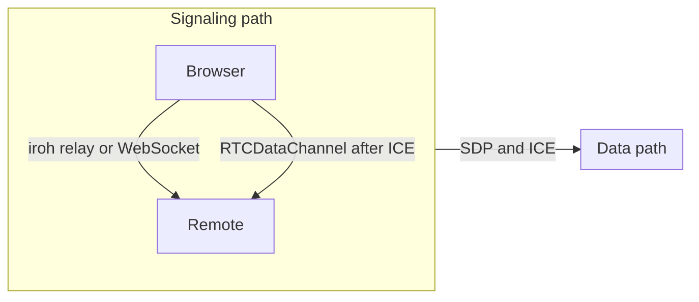
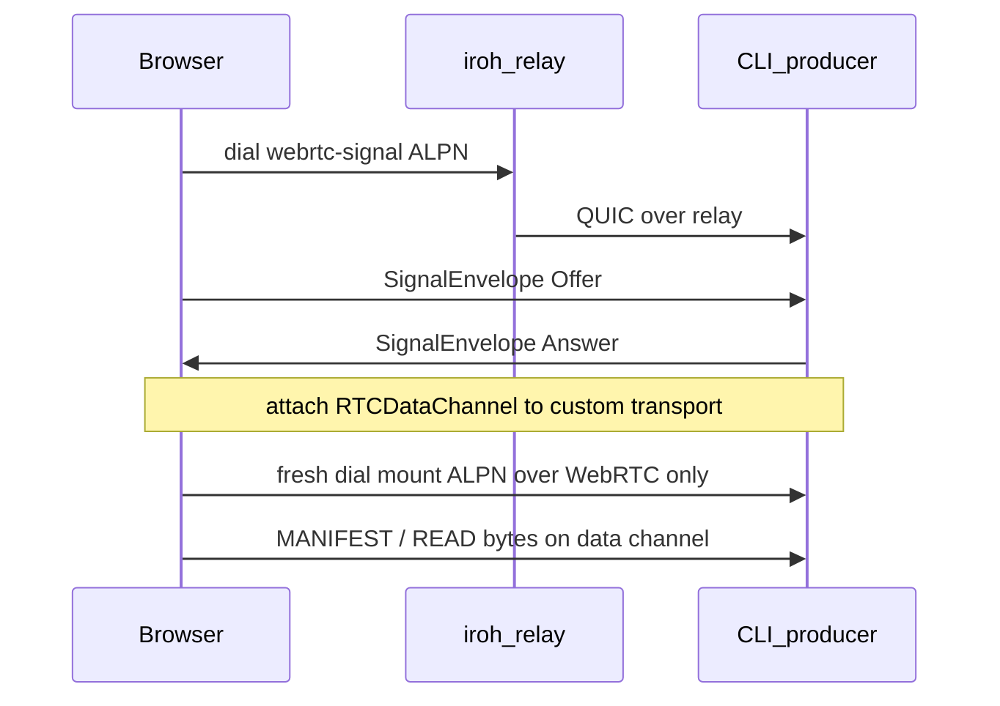

# Iroh + WebRTC research

Research into existing WebRTC + iroh implementations that can run on the web, how they are architected, and what we should borrow for [`crates/fofoca-iroh-webrtc-transport`](../../../crates/fofoca-iroh-webrtc-transport/). Dated August 2026.

Related product plan: [`docs/web-plan.md`](../../web-plan.md) (some NAT/TURN notes there are superseded; see [Open risks](#open-risks) and our architecture section below).

## TL;DR

The public landscape is thin: **two community crates** plus **official iroh’s relay-only browser story** and a few adjacent experiments. Nobody ships a mature, n0-blessed WebRTC custom transport yet ([discussion #4024](https://github.com/n0-computer/iroh/discussions/4024)).

Our stack already matches n0’s preferred shape (str0m native, browser Web APIs, custom transport, iroh relay for signaling). The highest-ROI gaps are **reliability**, not architecture: browser has no data-plane fallback when ICE fails; host has STUN but no TURN; we use vanilla ICE (no trickle). Do **not** replace our crate with SuddenlyHazel’s published package — cherry-pick dial intent / trickle / facade ideas only.

## Problem framing

Browsers cannot send UDP to arbitrary addresses, so iroh’s hole-punching does not port. Official browser support is **relay-only over WebSockets** ([wasm-browser docs](https://docs.iroh.computer/languages/wasm-browser)). Direct browser paths need WebRTC (or WebTransport with caveats n0 has already rejected as insufficient).

Custom transports (iroh ≥ 0.97, `unstable-custom-transports`) let an endpoint carry noq/QUIC datagrams over something other than UDP/relay. WebRTC is a natural fit **and** brings its own NAT traversal, so coordination payloads (SDP / ICE) still need another path. That coordination is **not** provided by the custom-transport API alone ([flub / matheus23 in #4024](https://github.com/n0-computer/iroh/discussions/4024)). Every working system below therefore splits:

## Landscape

| Project | Role | Runs on the web? |
| --- | --- | --- |
| **Ours** — [`crates/fofoca-iroh-webrtc-transport`](../../../crates/fofoca-iroh-webrtc-transport/) + [`agent-share-wasm-client`](../../../crates/agent-share-wasm-client/) | In-tree custom transport for agent-share | Yes: `web-sys` RTC + iroh signal ALPN; mount over a fresh WebRTC-only dial |
| **[SuddenlyHazel/iroh-webrtc-transport](https://github.com/SuddenlyHazel/iroh-webrtc-transport)** (`0.1.0-alpha.2` on [crates.io](https://crates.io/crates/iroh-webrtc-transport) / [docs.rs](https://docs.rs/iroh-webrtc-transport/)) | High-level facade over custom transport | Yes: `BrowserWebRtcNode` main-thread Wasm; native via **webrtc-rs** |
| **[anchalshivank/iroh-webrtc-transport](https://github.com/anchalshivank/iroh-webrtc-transport)** (from [#4024](https://github.com/n0-computer/iroh/discussions/4024)) | Library + browser/native demos | Yes: thin WASM iroh for JSEP; **JS** `RTCPeerConnection` in `static/app.js`; native **str0m** |
| **Official iroh** | Relay-only browser + custom-transport patterns | Relay yes; WebRTC not shipped. Patterns: [`iroh-tor-transport`](https://github.com/n0-computer/iroh-tor-transport), [`iroh-nym-transport`](https://github.com/n0-computer/iroh-nym-transport) |
| **Adjacent** | Not full iroh custom transports | [matchbox](https://github.com/johanhelsing/matchbox) (signaling swap idea in [iroh-examples#113](https://github.com/n0-computer/iroh-examples/issues/113)); abandoned in-tree effort [#3440](https://github.com/n0-computer/iroh/pull/3440) |

No other published “iroh custom transport + browser WebRTC” crates turned up in this pass.

**Name collision (resolved):** our workspace crate is `fofoca-iroh-webrtc-transport`. SuddenlyHazel’s package still occupies `iroh-webrtc-transport` on crates.io; treat them as unrelated implementations.

---

## Architecture write-ups

### Ours (`agent-share` / `fofoca-iroh-webrtc-transport`)

**Goal:** browser is a first-class mount consumer. File bytes never touch the iroh relay; relay is SDP rendezvous only.

**Split:** one crate, two feature-gated backends. Protocol that must not drift lives at the crate root:

| Piece | Location | Notes |
| --- | --- | --- |
| Transport id | `WEBRTC_TRANSPORT_ID = 0x5752_5443` (`"WRTC"`) | Tor-style mnemonic; `custom_addr(endpoint_id)` = id + 32-byte pubkey |
| Signal envelope | `SignalEnvelope` Offer/Answer/Error | Vanilla ICE (candidates in SDP); `SIGNAL_VERSION = 1`; max 64 KiB |
| Data channel label | `"iroh"` | One channel per peer |
| Framing | **none** | One QUIC datagram = one binary SCTP message |

**Host (`feature = "host"`):** str0m sans-io + tokio driver; RFC 5389 STUN Binding from the **media socket** (`host/stun.rs`) for `server_reflexive` candidates; no TURN (comment in `stun.rs` points CLI fallback to iroh relay for mount data). Structure follows `iroh-tor-transport` / multihop: factory → endpoint → registry sender → per-session driver.

**Web (`feature = "web"`):** browser `RTCPeerConnection` via `web-sys`; default STUN (Google + Cloudflare); `IceServers::with_turn_fallback()` may add short-lived credentials from `https://turn.elixir-webrtc.org/` (demo TURN, not production). Gather wait ~10s then freeze SDP. Outbound gated by `bufferedAmount`.

**Signaling ownership:** application layer. ALPNs in `agent-share-proto`:

- `agent-share/webrtc-signal/1` — one bi-stream, one envelope each way
- `agent-share/mount/1` — file protocol on a **fresh** connection

**Why two connections:** iroh fans Initial packets to candidate paths only while the remote has no selected path. You cannot upgrade a live relay connection onto a newly attached WebRTC transport. Pattern: signal → `attach` session → dial mount against `EndpointAddr` with only `TransportAddr::Custom(custom_addr(remote))`.

**Wasm consumer quirk:** custom transports are registered at endpoint build time, but the session does not exist until signaling finishes. `ShareClient::connect` therefore uses **two endpoints, one key**: relay signaller, then Minimal + WebRTC-only data endpoint. ICE failure is fatal — no relayed mount path (`agent-share-wasm-client/src/lib.rs`).

**CLI consumer:** registers WebRTC additively; prefers IP/relay hole-punching first; WebRTC after discovery retries fail (avoids double congestion control when native works).

### SuddenlyHazel / crates.io `iroh-webrtc-transport`

**Goal:** bury WebRTC ceremony. App code dials with an iroh-style API; the crate owns bootstrap, ICE exchange, attach, and optional relay fallback.

**API surface:**

- Browser: `BrowserWebRtcNode` + `browser_app!` (main-thread Wasm only; older worker architecture removed)
- Native: `NativeWebRtcIrohNode`
- Dial: `WebRtcDialOptions::{webrtc_preferred, webrtc_only, iroh_relay}` (default preferred)
- Lower level: `WebRtcTransport` + `configure_endpoint`, `NativeWebRtcSession`

**Native stack:** [webrtc-rs](https://crates.io/crates/webrtc) 0.17 (not str0m). **Browser stack:** `web-sys` RTC on the main thread, pumping iroh/noq through `RTCDataChannel`.

**Bootstrap signaling (built into the crate):** authenticated iroh stream carrying a richer `WebRtcSignal` enum:

- `DialRequest` (includes `BootstrapTransportIntent`)
- `Offer` / `Answer` (SDP)
- **`IceCandidate` / `EndOfCandidates`** (trickle ICE)
- `Terminal` (failure / fallback / cancel)

Data channel label: `"iroh-noq"`. Custom transport id mnemonic `iwrtc` (`0x6977_7274_6300_0001`) with capability vs session address kinds (session id derived from dial id).

**Framing:** private `IWRT` binary frame (magic + version + flags + session_id + segment_size + payload) over the data channel — extra layer above noq packets.

**ICE policy:** STUN-only in `WebRtcIceConfig` (TURN URLs rejected). When WebRTC cannot promote, **fallback is iroh relay**, not TURN. Tunables for queue sizes, frame max payload, DataChannel buffered-amount high/low watermarks (defaults in the multi‑MiB range).

**Demos:** Trunk browser chat / ping-pong examples under `examples/`.

**Takeaway vs us:** higher-level product API; trickle ICE; explicit dial intent with relay data fallback; heavier framing and webrtc-rs native; same high-level split (iroh bootstrap → WebRTC data).

### anchalshivank / discussion #4024 crate

**Goal:** working reference after n0 asked for an out-of-tree crate (patterned on tor/nym transports). Author reported native–native, browser–browser, and browser–native working (May 2026), with a note about moving fully to str0m (Cargo already depends on str0m).

**Library shape:**

| Piece | Role |
| --- | --- |
| `Signaling` trait | `send_envelope` / `recv_envelope` |
| `SignalEnvelope` | JSON offer/answer SDP |
| `QuicSignaling` | newline-framed JSON on iroh bidi (`JSEP_SIGNALING_ALPN = iroh-webrtc-transport/signal/0`) |
| `TcpWebSocket` | same envelopes over tokio-tungstenite |
| `negotiate_dc_as_{offerer,answerer}` | str0m JSEP over any `Signaling` |
| `WebRtcTunnel` / `WebRtcTransport` | bridge SCTP ↔ `CustomTransport` poll_send/poll_recv |

**Native ICE:** `jsep_core` binds ephemeral UDP and adds a **host** candidate. No STUN helper comparable to ours — LAN-friendly demos, weaker NAT story than our host STUN path.

**Browser architecture (important delta):** WASM (`browser-iroh`) only binds an iroh endpoint and exposes `acceptJsepSignaling` / `dialJsepSignaling`. **RTC lives in JavaScript** (`static/app.js`): `RTCPeerConnection`, gather-complete, data channel chat. Optional WebSocket room signaling server pairs two tabs without node ids. So the demo is “iroh for signaling + JS WebRTC for data,” not “full iroh custom transport inside the tab for app traffic” (though Rust `examples/server` / `client` show the full attach path natively).

**Transport id:** `u64::from_le_bytes(*b"irohwebr")` — third distinct id in the ecosystem.

**Takeaway vs us:** pluggable signaling and excellent demos; browser split (JS RTC) is simpler for chat UIs but not our all-Wasm mount client; native NAT gathering lags ours.

### Official iroh and adjacent

**Browser (official):** compile with wasm-bindgen; permanent WebSocket to home relay; E2E encrypted but no direct path ([wasm-browser](https://docs.iroh.computer/languages/wasm-browser), [tracking #2799](https://github.com/n0-computer/iroh/issues/2799)). FAQ still contrasts WebRTC complexity with iroh’s QUIC model and notes WebRTC remains the hole-punch option in browsers ([FAQ](https://docs.iroh.computer/about/faq)).

**Custom transport pattern:** implement `CustomTransport` / `CustomEndpoint` / `CustomSender`; often ship a `Preset` that also installs address lookup ([tor blog](https://www.iroh.computer/blog/tor-custom-transport), [0.97 blog](https://www.iroh.computer/blog/iroh-0-97-0-custom-transports-and-noq)). WebRTC needs extra coordination beyond that API.

**n0 preference (matheus23):** str0m on native; Web APIs on Wasm; out-of-tree crate — not a monolith PR ([#4024](https://github.com/n0-computer/iroh/discussions/4024)). Speculative: carry coordination in address-lookup user data.

**matchbox:** simple unreliable/reliable WebRTC sockets for games; own signaling server. iroh-examples#113 swapped that signaling for iroh components. Useful as a “thin socket API” reference, not as a drop-in `CustomTransport`.

**PR #3440:** pre–custom-transport attempt to land WebRTC in iroh; superseded by the out-of-tree approach.

---

## Comparison

| Dimension | Ours | SuddenlyHazel | anchalshivank |
| --- | --- | --- | --- |
| Native WebRTC | str0m + own STUN | webrtc-rs | str0m (host candidates) |
| Browser WebRTC | `web-sys` in Wasm | `web-sys` in Wasm facade | JS in page; Wasm = iroh signal |
| Signaling owner | app ALPNs | crate bootstrap protocol | `Signaling` trait (QUIC / WS) |
| Trickle ICE | no (vanilla) | yes (`IceCandidate` / `EndOfCandidates`) | no (vanilla / gather-complete) |
| Host TURN | no | no (by policy) | no |
| Browser TURN | optional elixir demo | no (iroh relay fallback instead) | depends on page `iceServers` |
| Data fallback if ICE fails | CLI: iroh IP/relay; **wasm: hard fail** | `webrtc_preferred` → iroh relay | demos usually fail open |
| DC framing | none (1:1 datagram) | `IWRT` frames | none (raw payloads) |
| DC label | `iroh` | `iroh-noq` | demo `chat` / configurable |
| Transport id | `0x5752_5443` WRTC | `0x6977_7274_6300_0001` iwrtc | `irohwebr` LE bytes |
| API altitude | low-level transport + app wiring | high-level node facade | mid-level lib + bins |
| Maturity | in-tree for agent-share; experimental | alpha on crates.io; large surface | demos + discussion follow-up |

---

## Recommendations (sorted by ROI)

Changes we should consider for **our** implementation. Effort and payoff are relative to agent-share’s browser consumer goal.

### 1. Browser mount fallback to iroh relay when ICE fails — highest ROI

**What:** Mirror SuddenlyHazel’s `webrtc_preferred`: if the data channel never opens (or ICE fails), dial `agent-share/mount/1` over the normal relay/IP path instead of hard-failing in `ShareClient::connect`.

**Why:** Opening a share link must work across bad NATs and blocked UDP. We already accept relay for signaling; using it as a degraded data plane is worse latency/cost but far better than a dead page. CLI consumer already prefers native then WebRTC; wasm is the hole.

**Effort:** Medium — needs a data endpoint that still has relay (or keep the signaller alive / single-endpoint redesign), and UI honesty that `transport()` may be `"relay"`.

### 2. Host TURN (or credentialed relay candidates for str0m) — high ROI

**What:** Add TURN gathering on the host side, symmetric with browser `with_turn_fallback()`, preferably project-owned credentials rather than elixir-webrtc.

**Why:** Browser can get `relay` candidates; host/`str0m` cannot today. Symmetric NAT ↔ symmetric NAT (common browser↔CLI) fails ICE even with good STUN. SuddenlyHazel deliberately skips TURN and falls back to iroh relay; we want **true P2P when possible**, so TURN on both sides raises ICE success before falling back.

**Effort:** Medium–high — str0m exposes `Candidate::relayed` but TURN allocate/refresh I/O is ours (same class of work as `host/stun.rs`).

### 3. Trickle ICE on the signal ALPN — medium-high ROI

**What:** Extend `SignalEnvelope` (or a v2) with candidate / end-of-candidates messages, modeled on SuddenlyHazel’s `WebRtcSignal::IceCandidate` / `EndOfCandidates`. Start ICE checks before gathering finishes.

**Why:** Vanilla ICE waits for gather (host STUN timeouts + browser ~10s budget) before the SDP leaves. Trickle cuts time-to-first-byte on good networks and reduces failed gathers that stall the whole offer.

**Effort:** Medium — wire + both backends; keep v1 envelopes for a transition or bump `SIGNAL_VERSION` / ALPN.

### 4. Small wasm “connect” facade (without adopting SuddenlyHazel’s crate) — medium ROI (DX)

**What:** One API that owns signal → attach → fresh mount dial (and eventually fallback #1), so `agent-share-wasm-client` is not open-coded two-endpoint choreography.

**Why:** The two-endpoint dance is correct but brittle. SuddenlyHazel’s `BrowserWebRtcNode` proves the DX win; we only need a thin agent-share-shaped helper, not their protocol registry / benchmarks / `IWRT` framing.

**Effort:** Medium; pairs well with #1.

### 5. Optional `Signaling` trait in our crate — lower ROI, nice for tests

**What:** anchal’s pattern: abstract `send_envelope` / `recv_envelope` so loopback and unit tests don’t need full agent-share ALPNs.

**Why:** We already have in-memory JSEP in `tests/loopback.rs`. A trait clarifies the carrier-agnostic contract and eases future WS/debug paths. Not load-bearing for production.

**Effort:** Low.

### 6. Keep no extra DataChannel framing — keep (negative recommendation)

SuddenlyHazel’s `IWRT` frame adds session_id/segment metadata on every datagram. Our 1:1 mapping matches noq’s packet model and MTU expectations with less code and less overhead. Only revisit if we need multiplexing multiple sessions on one channel (we use one channel per peer today).

### 7. Keep str0m; do not switch to webrtc-rs — keep

Matches n0 guidance, fits sans-io + our STUN-on-media-socket design, and avoids webrtc-rs binary weight. anchal’s direction is also str0m. SuddenlyHazel’s webrtc-rs choice is the outlier.

### 8. Do not vendor or replace with SuddenlyHazel’s crate — keep

Reasons: crates.io name collision; webrtc-rs; mandatory framing; STUN-only ICE policy vs our TURN aspirations; huge browser_runtime; dial/bootstrap ALPNs and identity model differ from agent-share tickets. **Cherry-pick ideas (#1–#4), not the dependency.**

### 9. Watch upstream address-lookup user-data for signaling — park

matheus23 suggested coordination payloads might ride lookup user data. If iroh lands that, signaling ALPNs might shrink. No action until upstream designs it.

### 10. Do not adopt matchbox as the transport — park

Wrong abstraction for `CustomTransport` + noq. Signaling-server replacement ideas are already covered by iroh relay + our ALPN.

---

## Open risks

1. **Crate naming:** workspace crate is `fofoca-iroh-webrtc-transport` to avoid colliding with SuddenlyHazel’s crates.io `iroh-webrtc-transport`.
2. **`unstable-custom-transports`** — API can move; pin strategy must stay explicit.
3. **Double congestion control** — QUIC over SCTP/DTLS. Why CLI prefers native paths when available.
4. **Public demo TURN** (`turn.elixir-webrtc.org`) — fine for experiments; not for volume or SLA.
5. **Wasm two-endpoint limitation** — build-time transport registration forces the signaller/data split until iroh allows late registration or our facade hides it.
6. **In-place path upgrade** — still impossible without upstream iroh changes; two-connection dance remains.
7. **Three incompatible transport ids / channel labels / envelope shapes** across ecosystems — interop with SuddenlyHazel or anchal is not free; don’t assume wire compatibility.

---

## Sources

### Community implementations

- [SuddenlyHazel/iroh-webrtc-transport](https://github.com/SuddenlyHazel/iroh-webrtc-transport) — README, `src/core/signaling.rs`, `src/core/frame.rs`, `src/config.rs`, `src/core/addr.rs`
- [docs.rs/iroh-webrtc-transport](https://docs.rs/iroh-webrtc-transport/) / [crates.io](https://crates.io/crates/iroh-webrtc-transport) — `0.1.0-alpha.2`
- [anchalshivank/iroh-webrtc-transport](https://github.com/anchalshivank/iroh-webrtc-transport) — README, `src/lib.rs`, `jsep_core.rs`, `bridge.rs`, `transport.rs`, `browser-iroh/`, `static/app.js`

### n0 / iroh

- [Discussion #4024 — Implementing a WebRTC Transport](https://github.com/n0-computer/iroh/discussions/4024)
- [wasm-browser docs](https://docs.iroh.computer/languages/wasm-browser)
- [FAQ — iroh vs WebRTC](https://docs.iroh.computer/about/faq)
- [Iroh & the Web (blog)](https://www.iroh.computer/blog/iroh-and-the-web)
- [iroh 0.97 custom transports (blog)](https://www.iroh.computer/blog/iroh-0-97-0-custom-transports-and-noq)
- [Tor custom transport (blog)](https://www.iroh.computer/blog/tor-custom-transport)
- [n0-computer/iroh-tor-transport](https://github.com/n0-computer/iroh-tor-transport)
- [n0-computer/iroh-nym-transport](https://github.com/n0-computer/iroh-nym-transport)
- [Tracking: WebAssembly support #2799](https://github.com/n0-computer/iroh/issues/2799)
- [iroh-examples#113 matchbox + iroh signaling](https://github.com/n0-computer/iroh-examples/issues/113)
- [PR #3440 (historical)](https://github.com/n0-computer/iroh/pull/3440)

### Adjacent

- [johanhelsing/matchbox](https://github.com/johanhelsing/matchbox)
- [str0m](https://docs.rs/str0m) — sans-io WebRTC; no TURN client / no candidate gathering

### This repo

- [`crates/fofoca-iroh-webrtc-transport/`](../../../crates/fofoca-iroh-webrtc-transport/) — especially `README.md`, `src/lib.rs`, `signaling.rs`, `addr.rs`, `host/stun.rs`, `web/jsep.rs`
- [`crates/agent-share-wasm-client/src/lib.rs`](../../../crates/agent-share-wasm-client/src/lib.rs) — two-endpoint consumer
- [`crates/agent-share/src/mount/webrtc.rs`](../../../crates/agent-share/src/mount/webrtc.rs) — signal + dial helpers
- [`docs/web-plan.md`](../../web-plan.md) — product architecture; note: “no TURN” and early “zero NAT traversal” claims are outdated relative to current host STUN + browser TURN fallback
